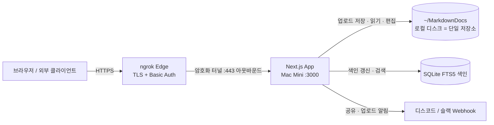

# 프로젝트 기획·개발 문서 — Husky Works MDs (v1.0 Final)

> 기준: `MacMini_MD_Workspace_Plan_v3_3.md` / `v4.0_Final.md` + 사용자 확정 요구사항 8개 + 결정 D1~D6.
> 상태: **전 항목 확정 (단일 기준 문서)**. 저장소=로컬 디스크 통합, 업로드=웹→디스크 직접 저장(FTP 미사용),
> 편집 유지, 검색=SQLite FTS5(trigram), 공유·알림=디스코드/슬랙 Webhook(카카오 제외).
> v4.0의 아키텍처 서술은 반영하되, v4.0에 없던 인증·보안 레이어는 본 문서 기준으로 유지.

| 항목 | 내용 |
|------|------|
| 문서 버전 | v1.0 Final |
| 대상 환경 | Mac Mini (상주 Node 프로세스, `next start`) |
| 외부 노출 | 인터넷 공개 — ngrok (무료 플랜) |
| 저장소 | **로컬 디스크 `~/MarkdownDocs` (단일 저장소)** |
| 프레임워크 | Next.js (App Router) |

---

## 1. 프로젝트 개요

맥미니 로컬에 저장된 `.md`/미디어를 인터넷 공개 웹에서 **업로드·조회·편집·공유**하는 파일 관리 앱.
업로드 파일은 로컬 디스크에 저장되고, 같은 디스크를 웹 GridView·뷰어·에디터가 직접 다룬다.

---

## 2. 요구사항 → 기능 매핑

| # | 요구사항 | 기능 / API | 상태 |
|---|----------|------------|------|
| 1 | 외부 접속 웹사이트 | ngrok 공개 + 엣지/앱 이중 인증 | ✅ |
| 2 | 생성 md를 웹 통해 업로드 | `POST /api/upload` → 로컬 저장 | ✅ (D1=A) |
| 3 | 저장/읽기 = 맥미니 로컬 디스크 | 단일 저장소 `~/MarkdownDocs` | ✅ |
| 4 | 웹 md viewer | `GET /api/file-content` + 렌더 | ✅ |
| 5 | 업로드 파일 폴더 그룹화 표시 | 폴더 GridView | ✅ |
| 6 | 폴더 클릭→md 리스트→뷰어 | 내비게이션 흐름(§4.3) | ✅ |
| 7 | 폴더/md 웹 공유 | 소셜 공유 **디스코드/슬랙** | ✅ (D3/D4) |
| 8 | (선택) 업로드 완료 알림 | 업로드 훅 → 디스코드/슬랙 | ✅ 포함(D6) |
| + | 마크다운 편집 | Monaco `PUT /api/file-content` | ✅ 유지(D5) |
| + | 검색·정렬·태그(v3.3) | FTS5 검색 + 정렬 + 태그 칩 | ✅ 포함 |

---

## 3. 시스템 아키텍처

### 3.1 기술 스택

| 레이어 | 선택 | 비고 |
|--------|------|------|
| 프레임워크 | Next.js (App Router) | API + UI |
| 업로드/읽기 | Node `fs` | 로컬 디스크 직접 (FTP 미사용) |
| 뷰어/편집 | 마크다운 렌더 + @monaco-editor/react | 읽기 + 편집(Cmd+S) |
| 이미지 | sharp | 썸네일 + 디스크 캐시 |
| 검색 | SQLite FTS5 (trigram) | 본문 + 태그, 한글 부분검색 |
| 공유/알림 | 디스코드·슬랙 Webhook | 서버 전용 (카카오 제외) |
| 인증 | 단일 패스워드 세션 | 1인 사용 |
| 터널 | ngrok + Traffic Policy | 엣지 Basic Auth |

---

## 4. 기능 명세

### 4.1 웹 업로드 → 로컬 저장 (요구사항 2·3, **1차**)
- `POST /api/upload` (`multipart/form-data`): 파일을 `~/MarkdownDocs` 하위에 저장.
- 구현: Node.js `fs/promises`로 로컬 디스크에 직접 기록(Direct Write). FTP 서버/프로토콜 미사용, 세션 인증된 사용자만 업로드.
- 저장 경로는 `MARKDOWN_ROOT` 하위로 강제 검증(§6). atomic write(임시 파일 → rename).

### 4.2 폴더 기반 GridView (요구사항 5)
- `GET /api/files?path=...`: 폴더 내 하위 폴더·파일 목록.
- Tailwind `grid grid-cols-2 md:grid-cols-4 gap-4` 반응형 카드.
- 폴더 카드: 아이콘 + 이름 + 파일 수. 이미지 카드: 썸네일. md 카드: 커버/첫 이미지 + 파일명.

### 4.3 폴더 → 리스트 → 뷰어 내비게이션 (요구사항 6)
- 폴더 아이콘 클릭 → 폴더의 md 리스트 → 항목 클릭 → 상세 뷰어.
- 상단 Breadcrumb(`Home > 폴더A > 폴더B`)로 상위 이동.

### 4.4 마크다운 뷰어 & 편집 (요구사항 4 + D5)
- `GET /api/file-content?path=...`: md 파싱·렌더(읽기 모드).
- `PUT /api/file-content`: @monaco-editor/react로 편집·저장(`Cmd+S`).
- 저장 시 `mtime` 비교로 "외부 변경됨" 경고, atomic write 적용.

### 4.5 검색·정렬·태그 필터 (포함) — **SQLite FTS5 + trigram**
- `GET /api/search?q=...`: FTS5 색인으로 파일명·본문·frontmatter 태그 검색. `snippet()` 하이라이트 요약 + BM25 관련도 정렬.
- **토크나이저**: `tokenize='trigram'` — 한국어 조사/부분일치 대응(예: "제주도"가 "제주도에서"에 매칭).
- **색인 갱신(증분)**:
  - 이벤트 기반: 업로드(`/api/upload`)·저장(`PUT /api/file-content`) 시 해당 파일만 갱신(앱 경유 변경 100% 커버).
  - (선택) 파일 감시(chokidar): 앱 밖(파인더·터미널) 변경분까지 포착.
- 다중 정렬 드롭다운(수정일/이름/크기/생성일순), frontmatter `tags` 수집 → 상단 태그 칩 필터.

### 4.6 소셜 공유 (요구사항 7, D3/D4 = 디스코드·슬랙)
- 폴더/md를 `POST /api/share/notify`로 공유 → Discord Embed / Slack Block Kit Webhook.
- 카카오는 제외. 공유·알림이 동일 Webhook 인프라를 공유.

### 4.7 업로드 완료 알림 (요구사항 8, 포함)
- 업로드 성공 시 디스코드/슬랙 Webhook 알림(파일명·폴더·링크 포함).
- 4.6과 동일 Webhook 계층 재사용.

### 4.8 이미지 썸네일 (디스크 캐시)
- `GET /api/thumbnail?path=...&w=400`: sharp 리사이즈 + 디스크 캐시.
- 캐시 키 `path + mtime + width` → 재시작에도 유지.

---

## 5. API 명세

| 메서드 | 경로 | 설명 | 인증 | 상태 |
|--------|------|------|------|------|
| POST | `/api/upload` | 파일 업로드 → 로컬 저장 | 세션 | **1차** |
| GET | `/api/files?path=` | 폴더/파일 목록(정렬·태그 포함) | 세션 | **1차** |
| GET | `/api/file-content?path=` | md 읽기(뷰어) | 세션 | **1차** |
| PUT | `/api/file-content` | md 저장(Monaco 편집) | 세션 | 확정 |
| GET | `/api/thumbnail?path=&w=` | 썸네일 | 세션 | 추가 |
| GET | `/api/search?q=` | 검색(본문·태그, 하이라이트) | 세션 | 확정 |
| POST | `/api/share/notify` | 공유·업로드 알림 Webhook | 세션 | 확정 |

> 모든 경로 파라미터는 `MARKDOWN_ROOT` 하위로 강제 검증(§6).

---

## 6. 보안 요구사항

### 6.1 앱 코드 레벨
- [ ] **Path Traversal 차단**: 업로드·읽기·편집 경로 모두 `path.resolve()` 후 `MARKDOWN_ROOT` 하위 검증.
- [ ] **업로드 검증**: 크기 상한, 확장자 화이트리스트, 파일명 새니타이즈.
- [ ] **Atomic write**: 업로드·편집 저장 모두 임시 파일 → rename.
- [ ] **편집 충돌 방지**: 저장 시 `mtime` 비교 경고.
- [ ] **전 라우트 세션 인증**: 업로드·목록·읽기·편집·검색·공유 모두 보호.
- [ ] **공유/알림 보호**: `/api/share/notify` 무인증 시 Webhook 스팸 악용 방지.
- [ ] **Rate limiting**: 업로드·공유 남용 방지.
- [ ] **자격증명 분리**: 세션 시크릿·Webhook URL은 `.env.local`, `.gitignore` 확인.
- [ ] **오류 비노출 + 감사 로그**.

### 6.2 ngrok 엣지 레벨
- [ ] **Basic Auth**(무료 플랜) — 무효 요청은 맥미니 도달 전 차단.
- [ ] **정적 도메인 예약** — URL 고정.
- [ ] **인바운드 포트 미개방**(아웃바운드 443) — 포트포워딩 금지.

> **이중 관문**: ngrok Basic Auth(엣지) + 앱 패스워드 세션(코드).

---

## 7. 개발 로드맵

| 단계 | 범위 | 산출물 |
|------|------|--------|
| **1** | 인증 + 웹 업로드(로컬 저장) | 세션 인증, `/api/upload`, 경로검증·atomic write |
| **2** | GridView + 뷰어 + Monaco 편집 + 썸네일 | `/api/files`, `/api/file-content`(GET/PUT), 폴더→리스트→뷰어, `/api/thumbnail` |
| **3** | 검색 · 정렬 · 태그 | FTS5 색인, `/api/search`, 정렬 드롭다운, 태그 칩 |
| **4** | 소셜 공유 (디스코드/슬랙) | `/api/share/notify`(Embed / Block Kit) |
| **5** | 업로드 완료 알림 | 업로드 훅 → 동일 Webhook 계층 |

---

## 8. 환경변수 (초안)

| 키 | 용도 |
|----|------|
| `MARKDOWN_ROOT` | 로컬 저장·읽기 루트(`~/MarkdownDocs`) |
| `SESSION_PASSWORD` | 단일 사용자 로그인 패스워드(해시) |
| `UPLOAD_MAX_BYTES` | 업로드 크기 상한 |
| `ALLOWED_EXTENSIONS` | 확장자 화이트리스트 |
| `RATE_LIMIT_MAX / WINDOW_SEC` | rate limit |
| `DISCORD_WEBHOOK_URL` | 디스코드 공유/알림 |
| `SLACK_WEBHOOK_URL` | 슬랙 공유/알림 |

> FTP env·카카오 키는 미사용으로 제거됨.

---

## 9. 결정사항 현황 (전부 확정)

| # | 항목 | 결정 |
|---|------|------|
| 인증 | 방식 | 단일 패스워드 세션 + ngrok Basic Auth (1인) |
| 검색 | 색인 | SQLite FTS5 + **trigram** (본문·태그, 한글 부분검색) |
| 썸네일 | 캐시 | 디스크 캐시 |
| ngrok | 요금제 | 무료 |
| D1 | 업로드 방식 | A) 웹 → 로컬 디스크 직접 저장 |
| D2 | FTP 다운로드 API | 제거 |
| D3 | 웹 공유 정의 | 소셜 공유 |
| D4 | 소셜 채널 | **디스코드 + 슬랙** (카카오 제외) |
| D5 | 편집(Monaco) | **유지** |
| D6 | 업로드 알림 | **포함** (디스코드/슬랙) |

---

## 10. 남은 확인사항
- 없음 — 모든 결정 확정. 다음 단계는 기능별 상세 스펙(요청/응답 스키마) 또는 구현 착수.
